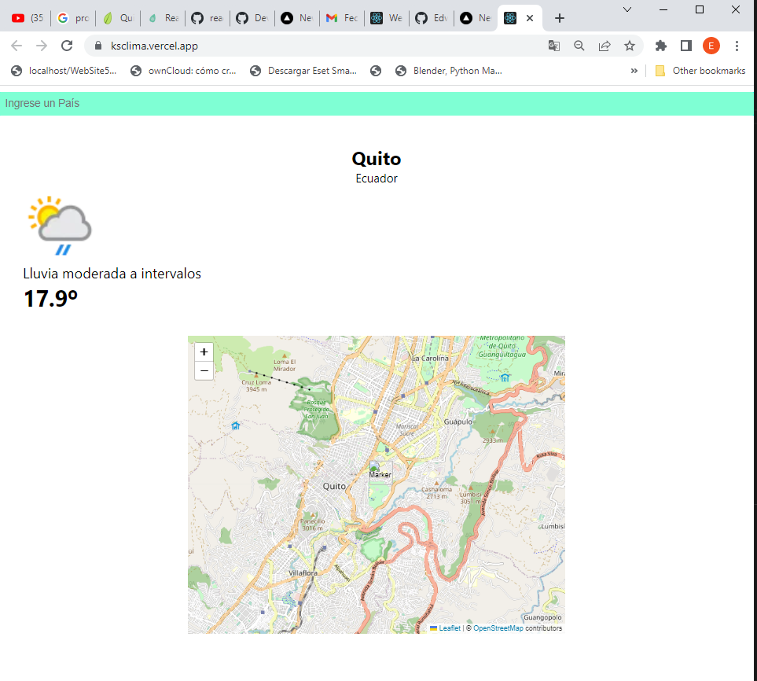

# Kruger Star todoList

>Proyecto de clima de useeffect para el consumo de api de Clima.

## Build with

- JavaScript
- React.js 18
- HTML + CSS
- react-leaflet

## Live Demo

[live demo link](https://ksclima.vercel.app/)

## API de clima

[link del demo de la API de Clima](https://www.weatherapi.com/api-explorer.aspx)

## Run it locally

### Setup

- Clone this repo using ` https://github.com/Edwin9226/ksclima` 

### Command
- `npm install` 
- `npm start`
- `navegador localhost:3000`

## Author

Clone this repo using `git clone https://github.com/Edwin9226/ksclima`
👤 **Edwin Miguel Pinchao Mueses**

- GitHub: [@Edwin9226](https://github.com/Edwin9226)

##  Contributing
- Juan Sotomayor - Tutor Kruger Star.

## Show your support

Give a ⭐ if you like this project!

## Acknowledgments
## 📝 License

This project is [MIT](./MIT.md) licensed.

